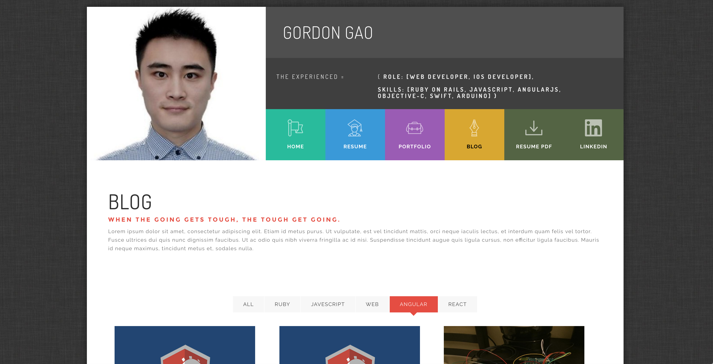

# Angular Assessment

This is a personal website with Angular front-end and rails backend. They are separate.
The idea is that I want an individual backend as the admin system, and the backend also has its own views in order to manage the database such as creating a new post.
It is not fully functional website. 
I add some functionalities to the 'blog' page, for instance, showing the post and adding comments. You are able to add new post in the backend after logged in.

## Installation

cd backend

bundle install

## Usage

In backend dir, to start the backend server

run: rails s

In client dir, to start node server

run: npm run s

